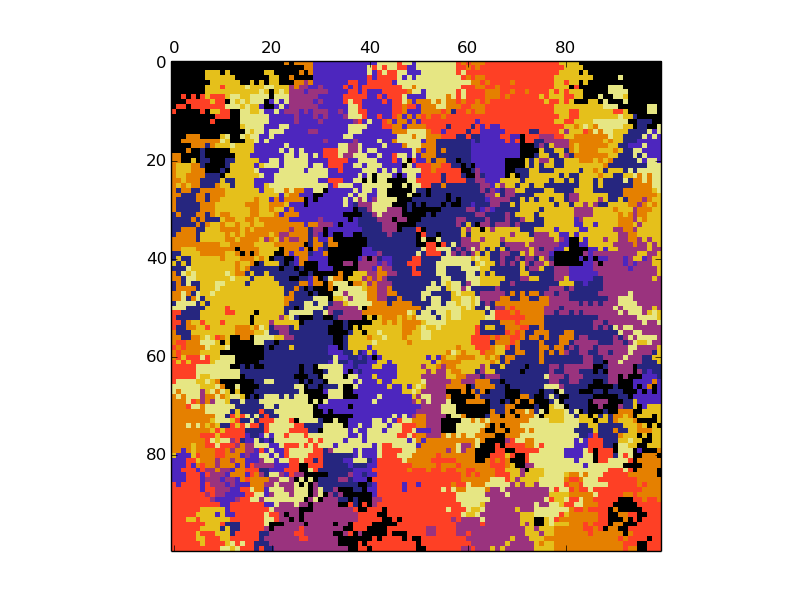

# Islands simulator

The idea for this project was to simulate a world composed with islands where each island possesses a color. At each time step a random islands takes the color of an adjacent island. This can be viewed as a Markov Chain if that floats your boat. The point is that in the *patches* start to appear.

There are three different script ``Flatland.py`` models a square flat world, whereas ``Torus.py`` models a round world; ie. islands on the edges can be colored by islands on the opposite edge. ``Animation.py`` is an infinite loop dynamic plot! If you let it turn for a day things can get interesting I suppose.